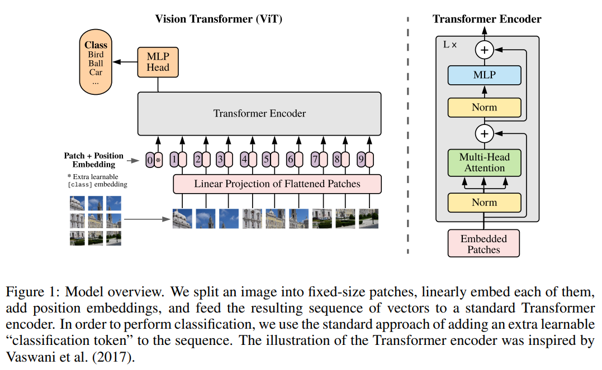
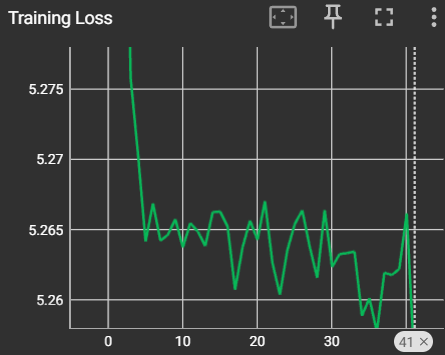
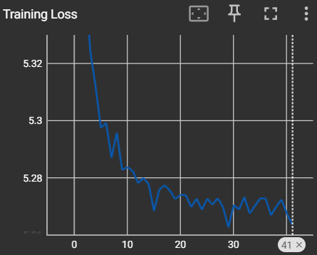

# Лабораторная работа 1: Классификация изображений

## Цель работы
Разработка методов глубокого обучения в задачах классификации изображений.

## 1. Теоретическая база
В этой лабораторной работе решается задача классификации изображений с применением методов глубокого обучения. Основной фокус направлен на разработку нейронной сети с использованием архитектуры Vision Transformer (ViT) и оптимизатора Adabound.

### 1.1 Vision Transformer (ViT)
Архитектура Vision Transformer (ViT) является одним из важных этапов в развитии методов глубокого обучения для обработки изображений. Представленная в работе "An image is worth 16x16 words: Transformers for image recognition at scale" (Dosovitskiy A. et al., 2020), ViT предлагает новый подход, при котором изображение разбивается на патчи, а затем обрабатывается с использованием механизма трансформера. Этот подход существенно отличается от традиционных сверточных нейронных сетей и продемонстрировал впечатляющую эффективность в решении задач классификации.

#### Принцип работы ViT
Изображение делится на небольшие фрагменты, называемые патчами. Каждый патч представляется в виде вектора, после чего эти векторы подаются на вход трансформеру. Механизм трансформера позволяет модели учить взаимосвязи между патчами и эффективно обрабатывать изображения различных размеров.



### 1.2 Adabound
Для эффективного обучения модели выбран оптимизатор Adabound, основанный на статье "Adaptive gradient methods with dynamic bound of learning rate" (Luo L. et al., 2019). Этот оптимизатор предоставляет динамическую регулировку скорости обучения в процессе обучения, что позволяет достигать баланса между скоростью сходимости и предотвращением расхождения.

#### Особенности
Adabound адаптирует скорость обучения на каждом шаге и автоматически регулирует ее в пределах динамических границ. Это улучшает процесс обучения, особенно в ситуациях, где стандартные методы, такие как Adam, могут сталкиваться с трудностями в подборе оптимальной скорости обучения.

## 2. Описание разработанной системы
### 2.1 Архитектура
Реализованная нейронная сеть построена на архитектуре Vision Transformer (ViT). Для обучения использовалась библиотека Torch.

### 2.2 Оптимизатор
Для обучения модели выбран и реализован оптимизатор Adabound, который обеспечивает эффективное обучение с динамическим регулированием скорости.

## 3. Результаты работы и тестирования системы
В ходе экспериментов было проведено обучение модели на датасете CarDatasets. Ниже представлены результаты:

### 3.1 Графики и результаты
Графики training loss для реализованного ViT с Adabound и Adam:




После 42 эпох обучения были получены следующие результаты:

Adabound
```plaintext
loss: 2649.912766933441
f1: 7.5960905453993e-05
accuracy: 0.0075
```
Adam
```plaintext
loss: 2650.2744002342224
f1: 5.076657528683116e-05
accuracy: 0.005
```

### 3.2 Быстродействие
Средняя скорость реализованной архитектуры:
```plaintext
C Adabound: 4.5 it/s (обучение одной эпохи 01:40)
С Adam: 1.30 it/s (обучение одной эпохи 06:11)
```

## 4. Выводы по работе
В ходе лабораторной работы была разработана и обучена модель для классификации изображений, использующая архитектуру Vision Transformer (ViT) и оптимизатор Adabound. Реализация с Adabound показала более высокую производительность по сравнению с Adam, что подчеркивает важность выбора оптимизатора для эффективного обучения в задачах классификации изображений.

## 5. Использованные источники
1. Dosovitskiy A. et al. "An image is worth 16x16 words: Transformers for image recognition at scale" //arXiv preprint arXiv:2010.11929. – 2020.
2. Luo L. et al. "Adaptive gradient methods with dynamic bound of learning rate" //arXiv preprint arXiv:1902.09843. – 2019.


---

**Исходный код:** [Lab1.ipynb](lab1/Lab1.ipynb)

**Автор:** Батурина Ксения, M4130

**Лицензия:** Этот проект распространяется под MIT License
